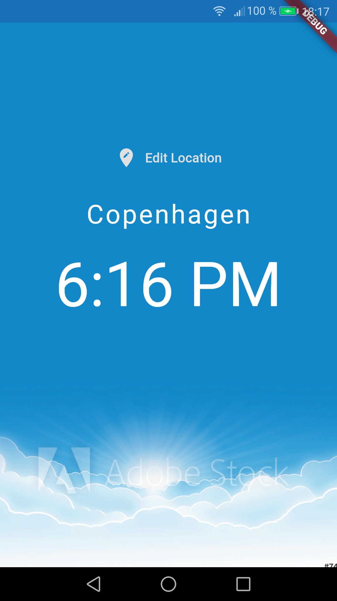

# World Time

A simple world clock application.

<!-- 

        

 -->

## Features

- creating several screens and handling routing.
- understanding widget lifecycle.
- writing asynchronous code with async, await and Futures.
- working with the 'http' package to collect data from a third party API.

Based on [Flutter Tutorial for Beginners](https://www.youtube.com/watch?v=1ukSR1GRtMU&list=PL4cUxeGkcC9jLYyp2Aoh6hcWuxFDX6PBJ) by Shaun Pelling - The Net Ninja (2019).
