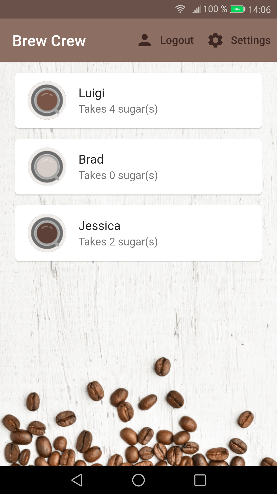

# Brew Crew

An app to collect brew preferences, using Firebase.

<!-- 

        

 -->

## Features

- setting up Firebase in a Flutter app.
- creating an authentication class with Firebase Auth.
- handling anonymous sign in with a custom user model.
- listening to auth stream with the 'provider' package.

Based on [Flutter & Firebase App Tutorial](https://www.youtube.com/playlist?list=PL4cUxeGkcC9j--TKIdkb3ISfRbJeJYQwC) by Shaun Pelling - The Net Ninja (2019).