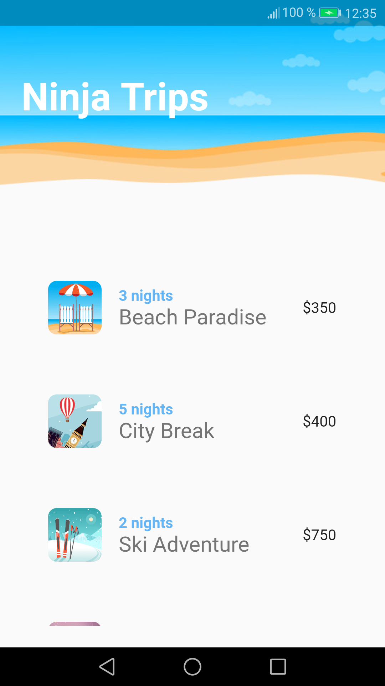

# Ninja Trips

A travel app to understand Flutter animations.

<!-- 

        

 -->

## Features

- setting up the Flutter starter project.
- discovering built-in animations.
- creating custom implicit animations with TweenAnimationBuilder.

Based on [Flutter Animation Tutorial](https://www.youtube.com/playlist?list=PL4cUxeGkcC9gP1qg8yj-Jokef29VRCLt1) by Shaun Pelling - The Net Ninja (2020).
