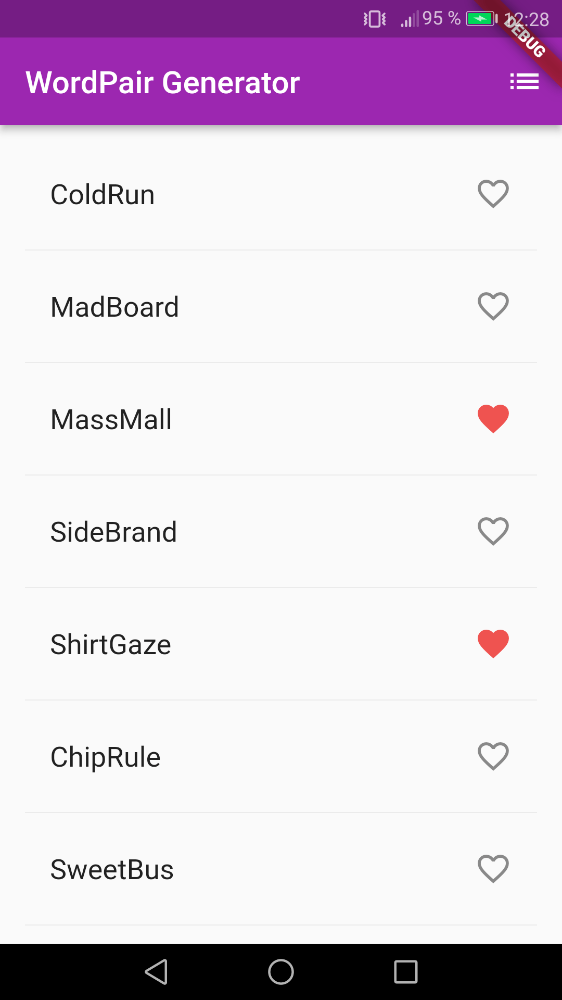

# Flutter Projects

This repo is made of 2 projects:

1. [**Wordpair Generator**](#wordpair): A quick intro to Flutter core concepts and Dart syntax.
2. [**World Time**](#worldtime): A simple world clock application.

##  1) Wordpair Generator

A quick intro to Flutter core concepts and Dart syntax.

[See 01-wordpair folder](https://github.com/solygambas/flutter-projects/tree/main/01-wordpair)

    

### Features

- adding [Dart](https://marketplace.visualstudio.com/items?itemName=Dart-Code.dart-code) and [Flutter](https://marketplace.visualstudio.com/items?itemName=Dart-Code.flutter) extensions in Visual Studio Code.
- creating a layout with Scaffold.
- adding a theme with ThemeData.
- installing english_words package from [pub.dev](https://pub.dev/) as a dependency.
- building a custom widget.
- displaying generated words with ListView.
- handling favorites with setState.
- using the navigator to display saved word pairs.

Based on [Flutter Crash Course](https://www.youtube.com/watch?v=1gDhl4leEzA) by Brad Taversy (2019).

##  2) World Time

A simple world clock application.

[See 02-world-time folder](https://github.com/solygambas/flutter-projects/tree/main/02-world-time)

<!-- 

    

 -->

### Features

- creating several screens and handling routing.
- understanding widget lifecycle.
- writing asynchronous code with async, await and Futures.
- working with the 'http' package to collect data from the World Time API.
- creating a custom WorldTime class to handle API calls.
- handling errors with try and catch blocks.
- passing data between screens. 
- formatting time with the 'intl' package.
- displaying a loading spinner with Flutter Spinkit.
- using a ternary operator to handle light and dark modes.

Based on [Flutter Tutorial for Beginners](https://www.youtube.com/watch?v=1ukSR1GRtMU&list=PL4cUxeGkcC9jLYyp2Aoh6hcWuxFDX6PBJ) by Shaun Pelling - The Net Ninja (2019).
