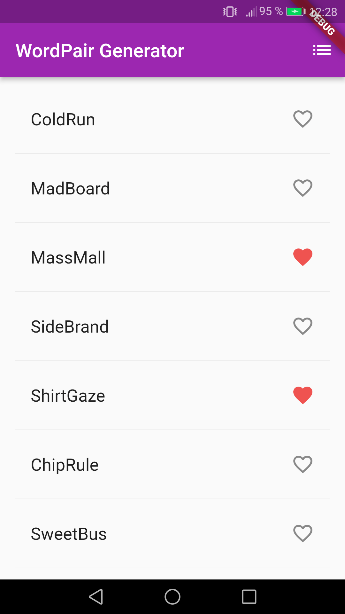

# Flutter Projects

A simple project to understand Flutter basics.

## Wordpair Generator

A quick intro to Flutter core concepts and Dart syntax.

[See wordpair folder](https://github.com/solygambas/flutter-projects/tree/main/wordpair)

    

### Features

- adding [Dart](https://marketplace.visualstudio.com/items?itemName=Dart-Code.dart-code) and [Flutter](https://marketplace.visualstudio.com/items?itemName=Dart-Code.flutter) extensions in Visual Studio Code.
- creating a layout with Scaffold.
- adding a theme with ThemeData.
- installing english_words package from [pub.dev](https://pub.dev/) as a dependency.
- building a custom widget.
- displaying generated words with ListView.
- handling favorites with setState.
- using the navigator to display saved word pairs.

Based on [Flutter Crash Course](https://www.youtube.com/watch?v=1gDhl4leEzA) by Brad Taversy (2019).

<!-- Based on [Flutter Tutorial for Beginners](https://www.youtube.com/watch?v=1ukSR1GRtMU&list=PL4cUxeGkcC9jLYyp2Aoh6hcWuxFDX6PBJ) by Shaun Pelling - The Net Ninja (2019). -->
